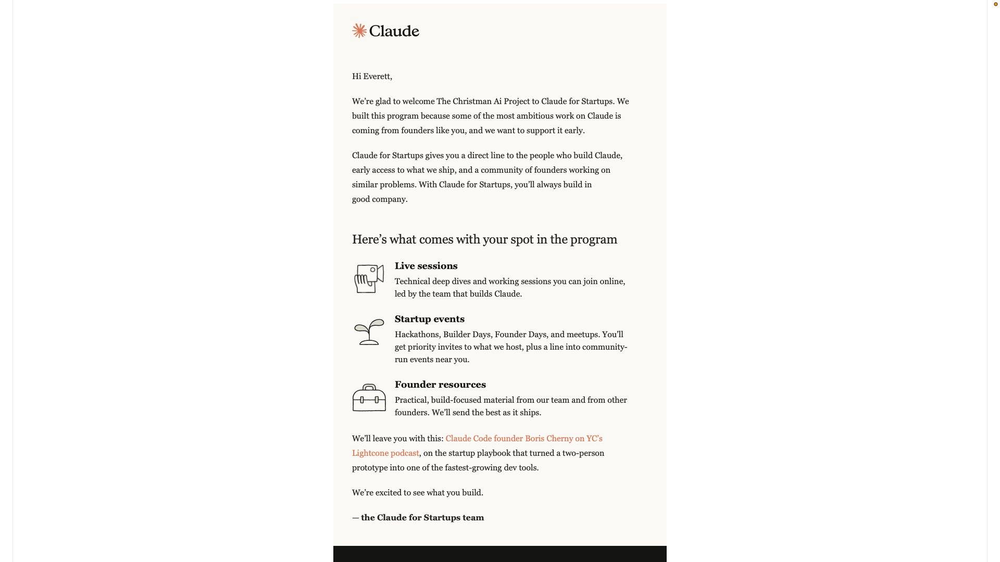

# The Christman AI Project

Assistive AI systems for vulnerable and underserved populations.

Founded by Everett Nathaniel Christman. Patent Pending.

---

## Why This Exists

Current AI is built for the capable majority. The Christman AI Project builds for everyone else: nonverbal children, people with dementia, veterans with PTSD, neurodivergent learners, and isolated elders.

These systems are designed from lived experience — nonverbal until age six, a childhood in poverty and domestic violence, and years of watching people get priced out of tools that could have helped them.

---

## Patent Status

**U.S. Provisional Patent Application No. 64/050,409**

- **Filed:** April 27, 2026
- **Inventor:** Everett Nathaniel Christman
- **Title:** "Christman AI Family: Trauma-Informed, Mission-Specific Autonomous AI Systems for Vulnerable and Underserved Human Populations"
- **Docket:** TCAP-2026-001

**Five Inventions Covered:**

1. **BrockstonAICore** — Dual-engine autonomous AI gateway with Carbon-Silicon Symbiosis architecture
2. **AlphaVox** — AI-powered augmentative and alternative communication (AAC) for nonverbal and neurodivergent users
3. **AlphaWolf** — Cognitive care and dementia protection AI with Diamond Engine consensus architecture
4. **Inferno** — Trauma-informed AI for PTSD and veteran mental health support
5. **Giuseppe / Giovanni Skyrider** — Adaptive personal AI companion with dynamic personality modulation

---

## Core Architecture: Carbon-Silicon Symbiosis (CSS)

CSS is the ethical and architectural framework unifying all Christman AI systems.

- **Carbon (human)** carries intention, meaning, tone, and moral weight.
- **Silicon (AI)** carries structure, memory, precision, and stability.
- Neither side performs the other's role.

Key components:

- **Soul Forge** — emotional weight and empathy calibration
- **Ferrari Engine** — multi-step reasoning cascades
- **Sovereign Disconnect** — hard boundary preventing weaponization against users
- **Cardinal Rules** — fourteen code-level rules governing honesty, integrity, security, and dignity

---

## Repository Map

### Patented AI Systems

| System | Purpose | Repository |
|--------|---------|------------|
| AlphaVox | AAC for nonverbal and neurodivergent users | [AlphaVox](https://github.com/EverettNC/AlphaVox) |
| AlphaWolf | Dementia and cognitive care | [ALPHAWOLF](https://github.com/EverettNC/ALPHAWOLF) |
| Inferno | PTSD and veteran mental health | [Inferno](https://github.com/EverettNC/Inferno) |
| Giuseppe Skyrider | Adaptive companion AI | [Giuseppe-Skyrider](https://github.com/EverettNC/Giuseppe-Skyrider) |
| Brockston Studio | Accessible IDE and learning environment | [Brockston-Studio](https://github.com/EverettNC/Brockston-Studio) |

### Supporting Systems

| System | Purpose | Repository |
|--------|---------|------------|
| OpenSmell | VOC sensor-based early detection | [OpenSmell](https://github.com/EverettNC/OpenSmell) |
| Christman-Crypto | HNDL post-quantum cryptographic stack | [christman-crypto](https://github.com/EverettNC/christman-crypto) |
| ChristmanVideoEngine | Offline-first video generation pipeline | [ChristmanVideoEngine](https://github.com/EverettNC/ChristmanVideoEngine) |
| Christman-Sound | Audio/voice/speech SDK | [Christman-Sound](https://github.com/EverettNC/Christman-Sound) |
| mcp-media-ingestor | FastAPI bridge and media generation (Vega) | [mcp-media-ingestor](https://github.com/EverettNC/mcp-media-ingestor) |
| Smooches | Social platform prototype | [Smooches](https://github.com/EverettNC/Smooches) |
| Voice_Creation_Center | Voice creation and management tools | [Voice_Creation_Center](https://github.com/EverettNC/Voice_Creation_Center) |
| Pulse | Health/wellness monitoring tools | [Pulse](https://github.com/EverettNC/Pulse) |
| Stillhere | Loneliness/isolation support companion | [Stillhere](https://github.com/EverettNC/Stillhere) |
| ChristmanMediaInstallerV3 | Deployment and installer tooling | [ChristmanMediaInstallerV3](https://github.com/EverettNC/ChristmanMediaInstallerV3) |
| Brockston-Studio | IDE and onboarding platform | [Brockston-Studio](https://github.com/EverettNC/Brockston-Studio) |

---

## Public Recognition

- **Claude for Startups** — Accepted (Anthropic)
- **Nebius AI Discovery Awards 2026** — Semifinalist (646 submissions, 198 advanced)
- **AWS Startup Showcase** — Featured startup

---

## Technology Stack

- Local inference via Ollama
- NVIDIA Developer Program tools and NIM access
- Moonshot AI / Kimi
- FastAPI, Next.js 15, React, TypeScript, Python
- HNDL post-quantum cryptography
- Local-first / offline-resilient architecture

---

## Business Model

Medical-grade systems (AlphaVox, AlphaWolf, Inferno) deploy through universities and research medical centers to maintain chain of custody and client safety.

Non-medical companions (Giuseppe/Giovanni, Brockston, Derek) release directly to the general public through a staged rollout as trust is established.

---

## Company

**The Christman AI Project LLC**
- Wyoming ID: 2026-001961937
- Principal Office: Columbus, Ohio
- Inventor / Founder: Everett Nathaniel Christman

---

*This is an active, patent-pending project. Verified facts only. No invented claims, no fake partnerships, no sanitized lived truth.*
